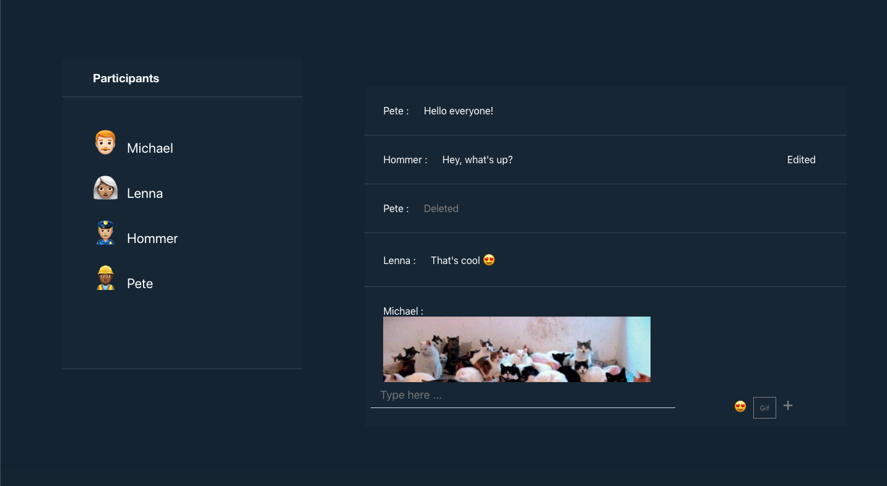
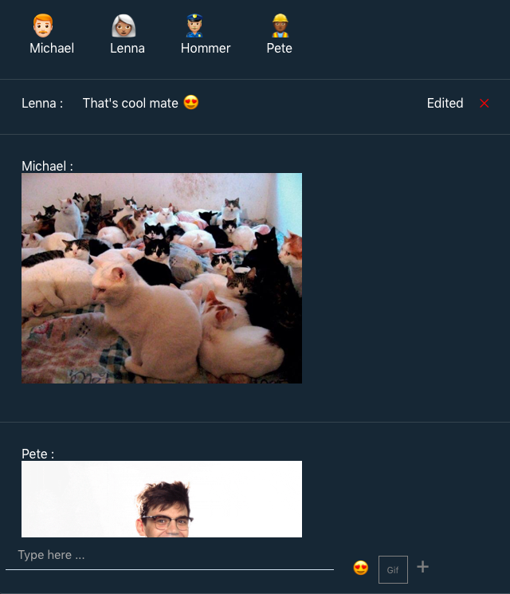

## RTC chat app

An application for real time communication with React, NodeJS & socket.io.

## Features

- Sending messages to participants in real time.
- Double click on the text to edit your own message. Other participants can see if it has been edited.
- Delete your own message & other participants can see that it has been deleted.
- See active participants in the session.
- Uploading images & files.
- Emojis & Giphy support.
- Fetching URLs & display a page preview on link hover.
- A responsive layout that supports on various devices, crafted with CSS.

## Getting Started

### Installation

    ```sh
    git clone https://github.com/aktn/RTC-chat-app
    ```

    ```sh
    cd client
    yarn install
    yarn start
    ```

    ```sh
    cd sockets
    yarn install
    yarn start
    ```

## Demo





